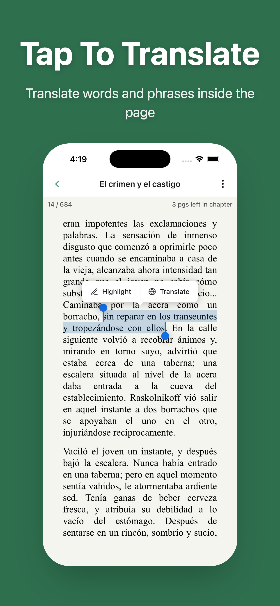
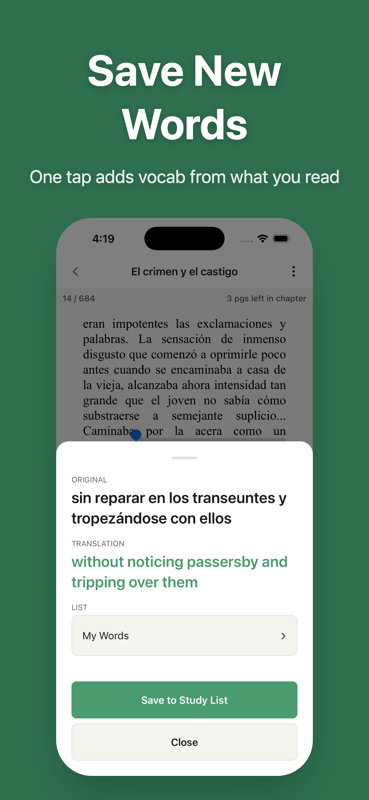

# LingoLeaf

A React Native (Expo) language-learning app: read EPUBs in foreign languages, translate selections inline, save vocabulary, and study with daily Focus Packs and a garden progress system.

**Open-source portfolio showcase** — not a commercial product. A shared demo backend may be available for trying the app; it is rate-limited and intended for evaluation only.


| Reader | Study | Progress |
| ------ | ----- | -------- |
|  |  |  |

## Highlights

- EPUB reader with text selection, highlights, and resume
- Real-time translation with shared cache (Edge Function + Google Translate)
- Vocabulary lists, flashcards, and **Daily Focus Pack** sessions
- Garden gamification tied to reading and study goals
- Multi-language UI (en, es, de, fr, ru)
- Supabase Auth (email, Google, Apple), RLS data isolation
- Premium architecture (RevenueCat + server-side entitlement sync) — requires your own backend keys to test purchases
- Typed analytics pipeline with offline queue

**Stack:** Expo 52 · TypeScript · React Navigation · Zustand · Supabase · `@epubjs-react-native`

## Web demo (portfolio embed)

Host the browser demo at **`/lingoleaf/demo`** on your portfolio site. This uses **Expo Web export**, not Expo Snack — Snack cannot run the native EPUB reader, AdMob, or RevenueCat modules.

### 1. Provision demo Supabase (greenfield)

```bash
chmod +x scripts/setup-demo-supabase.sh
./scripts/setup-demo-supabase.sh your-project-ref
```

This applies all migrations in [`supabase/migrations/`](./supabase/migrations/) and runs [`supabase/demo/seed.sql`](./supabase/demo/seed.sql) with public-domain demo books.

Enable **Auth → Anonymous sign-ins** in Supabase for guest demo access.

### 2. Build static web assets

```bash
cp .env.demo.example .env.demo
# Fill EXPO_PUBLIC_SUPABASE_URL / EXPO_PUBLIC_SUPABASE_KEY
npm install
npx expo install react-dom react-native-web @expo/metro-runtime
npm run export:web-demo
```

Output lands in `dist/web-demo/`. Deploy that folder to your site at `/lingoleaf/demo`.

Local preview:

```bash
npm run web:demo
```

### 3. Configure your portfolio host

- Serve the exported bundle under `/lingoleaf/demo`
- Add SPA fallback to `index.html` for client-side routes
- Optional auth callback env vars in `.env.demo`:
  - `EXPO_PUBLIC_AUTH_CALLBACK_ORIGIN=https://yourdomain.com/lingoleaf/demo/auth`

### Web demo vs native

| Feature | Web demo | iOS app |
| ------- | -------- | ------- |
| Library / study / garden | Yes | Yes |
| EPUB reading | Yes (epubjs paginated reader) | Yes (native WebView reader + selection) |
| Inline translate on selection | Limited | Full |
| Premium / ads | Disabled | Full |

## Try the demo

1. Clone the repo and install dependencies (see [Developer setup](#developer-setup)).
2. Copy `.env.example` → `.env`.
3. Use the **demo credentials** below (anon key only — safe for client use):

```env
EXPO_PUBLIC_SUPABASE_URL=https://your-demo-project.supabase.co
EXPO_PUBLIC_SUPABASE_KEY=your-demo-anon-key
```

> **Maintainers:** After rotating keys per [SECURITY.md](./SECURITY.md), replace the placeholders above with the live demo anon URL and key.

4. Build a **custom development client** (required for the EPUB reader):

```bash
npx expo run:ios
```

Expo Go does not support the native EPUB reader.

### What works in the demo

| Feature | Demo |
| ------- | ---- |
| Sign up / sign in | Yes |
| Read catalog EPUBs | Yes |
| Translate selections | Yes (rate-limited per user) |
| Save words, flashcards, garden | Yes |
| Premium purchases | No — requires your RevenueCat + App Store setup |
| Admin book uploads | No — server-side admin flag only |
| Email confirmation deep links | Requires your domain + Supabase SMTP config |

## Architecture

```
Reader selection
    → translate Edge Function (JWT + rate limit)
    → translation_cache (shared) or Google Translate API
    → study_words / vocab lists / Focus Pack planner

Premium purchase
    → RevenueCat SDK (device)
    → premium-entitlement-sync Edge Function (webhook + on-demand)
    → user_settings.is_premium (server-managed)
```

See [SECURITY.md](./SECURITY.md) for RLS, admin guards, and secret handling.

### Project layout

```
src/
├── screens/       # Home, Library, Reader, Study, Flashcards, Profile, …
├── components/    # Reader overlays, Focus Pack, garden cards, …
├── study/         # Focus Pack planning and caching
├── supabase/      # Client, queries, types
├── state/         # Zustand stores
├── analytics/     # Event taxonomy + flush queue
└── theme/         # Design tokens
supabase/
├── migrations/    # Postgres schema + RLS
└── functions/     # translate, study-pack-metadata, premium-entitlement-sync, …
```

## Developer setup

### Prerequisites

- Node.js 20+
- Xcode (iOS simulator or device)
- [Supabase CLI](https://supabase.com/docs/guides/cli) for Edge Functions
- Custom dev client (`npx expo run:ios`) — not Expo Go

### Quick start (demo backend)

```bash
npm install
cp .env.example .env
# Fill demo or your own EXPO_PUBLIC_SUPABASE_* values
npx expo run:ios
```

### Full local backend (bring your own Supabase)

1. Create a Supabase project.
2. Apply migrations in order from [`supabase/migrations/`](./supabase/migrations/).
3. Create a private Storage bucket `general-library` and apply storage RLS migrations.
4. Deploy Edge Functions:

```bash
supabase link --project-ref your-project-ref
./deploy-function.sh   # translate
supabase functions deploy study-pack-metadata
supabase functions deploy premium-entitlement-sync
supabase secrets set GOOGLE_TRANSLATE_API_KEY=your-key
# Optional: OPENAI_API_KEY, RevenueCat secrets — see .env.example
```

5. Insert at least one book row and upload an EPUB to Storage.

### Environment variables

Copy [`.env.example`](./.env.example) → `.env`. Never commit `.env`.

| Variable | Client-safe? | Purpose |
| -------- | ------------ | ------- |
| `EXPO_PUBLIC_SUPABASE_URL` | Yes | Supabase project URL |
| `EXPO_PUBLIC_SUPABASE_KEY` | Yes (anon) | Supabase anon key |
| `EXPO_PUBLIC_GOOGLE_*_CLIENT_ID` | Yes | Google Sign-In |
| `EXPO_PUBLIC_REVENUECAT_IOS_API_KEY` | Yes | RevenueCat public SDK key |
| `SUPABASE_SERVICE_ROLE_KEY` | **No** | Scripts / local admin only |
| `GOOGLE_TRANSLATE_API_KEY` | **No** | Edge Function secret |

Server-only secrets belong in Supabase Edge Function secrets or EAS environment variables — not in the repo.

### Email confirmation & deep links

For production-style auth redirects:

1. Supabase → Authentication → URL Configuration: add `lingoleaf://auth` and your HTTPS redirect page.
2. Host [`public/auth-redirect.html`](./public/auth-redirect.html) on your domain.
3. Configure Universal Links / App Links in `app.json` (`associatedDomains`, Android intent filters).
4. Configure SMTP in Supabase (e.g. Resend) for confirmation emails.

### Testing

```bash
npm test
npm run type-check
npm run security:check
```

## Email confirmation troubleshooting

If guest-to-user migration fails on sign-in, check Edge Function logs for `migrate-user-data`. Common fixes:

- Deploy the function: `supabase functions deploy migrate-user-data`
- Verify `EXPO_PUBLIC_SUPABASE_URL` and anon key in `.env`
- 401 → missing or invalid Authorization header from the client session

## Deployment (optional)

This repo is a showcase. To ship your own build:

1. Create an [Expo](https://expo.dev) project (`eas init`) and set `extra.eas.projectId` in `app.json`.
2. Configure EAS environment variables (mirror `.env` client vars).
3. Set `submit.production.ios.ascAppId` in `eas.json` to your App Store Connect app ID.
4. Use local signing via `credentials.json` (see `credentials.json.example`, gitignored) for `npm run ios:build:prod`.

## Contributing

See [AGENTS.md](./AGENTS.md) for code style and testing requirements.

## Security

See [SECURITY.md](./SECURITY.md) for vulnerability reporting and credential rotation.

Run `npm run security:check` before pushing.

## License

[MIT](./LICENSE)
